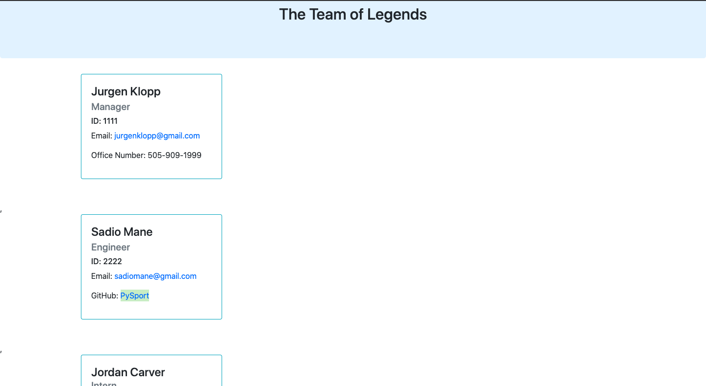

# TEAM-PROFILE-GENERATOR

## Description
This is a Node.js command-line application that takes in information about employees and generates an HTML webpage that displays summaries for each person on the team with links to their GitHub profiles and email addresses.

## Table of Content
- [Description](##Description)
- [Installation](##Installation)
- [Built With](##Built-With)
- [How to Use it](##Usage)
- [Credits](##Credits)
- [License](##License)
- [Questions](##Questions)

## Installation
The app used the following installations:
- JavaScript
- NPM Inquirer
- Node
- Jest (for testing) 

## Built With
- Node.js
- Javascipt
- NPM Inquirer
- Bootstrap

## Usage
Ensure you have the suitable installations. Starting from the command line, you can create a dashboard for employees within your company. You can find the role, name, ID, email, GitHub profile, and school for most employees. 

The follow images shows the finished product:

Click on the following link for a walkthrough video demonstrating its functionality: 
[YouTube](https://youtu.be/7bkk7G5yyNM)

## Credits
Thanks to @bdrawe for his help in explaining how to link html and dynamically create it.

## License

## Questions
* GitHub Username: 1jorcarver
* GitHub Profile: https://github.com/1jorcarver
* Preferred Method of Communication:
* Please email me with any questions, contribution requests, or concerns.
* Email: jordan_carver@hotmail.com
